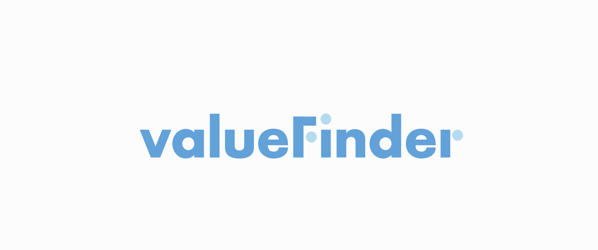

# valueFinder
> 사용자의 물건에 가치를 찾아주는 개인간 경매 서비스

## ⏰개발 기간 
* 23.08.04일 - 23.08.29일


## 소개:
ValueFinder는 사용자들이 소유한 물건의 정확한 가치를 찾아주는 개인간 경매 서비스입니다. 많은 사람들이 소유한 물건의 가치를 모르거나 판매하기 어려워하는 경우가 있습니다. 우리는 이러한 문제를 해결하고자 ValueFinder를 개발하였습니다.

>물품 등록과 경매: 사용자들은 물품을 등록하고 경매에 참여할 수 있습니다. 역경매 방식도 지원하여 판매자가 물품을 게시하면 구매자들이 경매 가격을 제시하고 최고 입찰자가 낙찰됩니다.

>매물 노출과 카테고리 분류: 메인화면에서는 인기 경매 매물, 마감 임박 매물, 신규 매물 등을 볼 수 있으며, 카테고리 별로 매물을 분류하여 검색이 용이합니다.

>낙찰 이후 과정: 낙찰된 사용자들은 판매자와의 거래 진행 상태를 확인하고 운송장번호를 등록할 수 있으며, 거래가 완료된 후 후기를 작성할 수 있습니다.


## 팀원
<table>
  <tbody>
    <tr>
      <td align="center"><a href="https://github.com/CLYZEN"><br /><sub><b>팀장 : 박승철</b></sub></a><br /></td>
      <td align="center"><a href="https://github.com/cheonyeonsu"><br /><sub><b>팀원 : 천연수</b></sub></a><br /></td>
      <td align="center"><a href="https://github.com/endendrh222"><br /><sub><b>팀원 : 고재혁</b></sub></a><br /></td>
      <td align="center"><a href="https://github.com/hanzoeun"><br /><sub><b>팀원 : 장정호</b></sub></a><br /></td>
      <td align="center"><a href="https://github.com/jyong0000"><br /><sub><b>팀원 : 허재용</b></sub></a><br /></td>
    </tr>
  </tbody>
</table>
<hr>

### [요구사항 정의서](https://docs.google.com/spreadsheets/d/1c3k7rrJRm8aGR6yoAZmZ8RixZN8eySa9zoqF2jCsORs/edit#gid=0)
### [간트 차트](https://docs.google.com/spreadsheets/d/14Vpw906-2PBuaMtk_2xPcMcmKJ7Zt-6X10sSfAEXYeA/edit#gid=1115838130)
### [ERD](https://www.erdcloud.com/d/AJECkdDa5fRg4ioaw)
### [화면설계](https://www.figma.com/file/4j0xwu1Sf5brnERaxpHHtr/valueFinder?type=design&mode=design&t=yU0yHCp2PAyd7yVh-0)

<hr>

## 📚 목차
* [사용 기슬 스택](#사용-기술-스택)
* [주요 로직](#주요-로직)
* [작업 규칙](#작업-규칙)

<hr>

## 사용 기술 스택
### 🧰개발 스텍
- LANGUAGE : ,, , ,
- FRAMEWORK : ,  
- DB : 
- SECURITY : 
- BULID : 
- TOOL : 
- ORM : 
##
<hr>

## 주요 로직

### 경매는 어떤식으로 진행되나요?

```
1. Ajax로 Controller에 요청.

function bidding() {

            var token = $("meta[name='_csrf']").attr("content");
            var header = $("meta[name='_csrf_header']").attr("content");


            var price = $("#sum").val();
            var url = '/auction/bidding';
            var method = "POST";

            $.ajax({
                url: url,
                type: method,
                beforeSend: function (xhr) {
                    xhr.setRequestHeader(header, token);
                },
                data: JSON.stringify({
                    auctionNo: auctionNo,
                    price: price
                }),
                contentType: "application/json",
                success: function (result, status, jqXHR) {
                    // 요청 성공 처리
                    alert('등록 완료');
                    window.location.reload();
                },
                error: function (jqXHR, status, error) {
                    if (jqXHR.status == '401') {
                        alert('로그인 후 이용해주세요.');
                        location.href = '/member/login';
                    } else {
                        alert(jqXHR.responseText);
                        window.location.reload();
                    }

                }
            });
        }


2. BiddingController에서 경매의 형식에 따라 요청을 1차적으로 거른 이후 Service로 넘겨줌.

@PostMapping(value = "/auction/bidding")
    public @ResponseBody ResponseEntity bidding(@RequestBody Map<String, Object> requestBody,
                                                Authentication authentication) {
        PrincipalDetails principalDetails = (PrincipalDetails) authentication.getPrincipal();

        try {
            Long auctionNo = Long.parseLong(requestBody.get("auctionNo").toString());
            Long price = Long.parseLong(requestBody.get("price").toString());

            Auction auction = auctionService.getAuction(auctionNo);

            if(auction.getItem().getMember().getEmail().equals(principalDetails.getUsername())) {
                return new ResponseEntity("본인 경매에는 입찰할 수 없습니다.", HttpStatus.LOCKED);
            }

            switch (auction.getAuctionStatus()) {
                case PENDING -> {
                    return new ResponseEntity("경매 시작 전입니다.", HttpStatus.LOCKED);
                }
                case PROGRESS, LAST -> {

                    if(price <= 0) {
                        return new ResponseEntity("0보다 큰 숫자를 입력해주세요.", HttpStatus.BAD_REQUEST);
                    }

                    // 비공개 경매라면
                    if (auction.getAuctionType() == AuctionType.SEALED) {
                        if(biddingService.chkSealedBidding(auction,principalDetails.getMember())) {
                            biddingService.chkStatus(auction);
                            biddingService.joinBidding(principalDetails.getUsername(), auctionNo, price);
                            return new ResponseEntity("입찰 완료", HttpStatus.OK);
                        } else {
                            return new ResponseEntity("비공개경매는 한번만 입찰 가능합니다.", HttpStatus.BAD_REQUEST);
                        }
                    }

                    // 비공개 경매가 아니라면
                    if (auction.getAuctionType() != AuctionType.SEALED) {

                        if (price <= auction.getAuctionNowPrice()) {
                            return new ResponseEntity("현재 금액보다 큰 금액을 입력해주세요.", HttpStatus.BAD_REQUEST);
                        }

                        // 현재 최상위 입찰자인지 검사
                        if(biddingService.chkBidding(auction,principalDetails.getMember())) {
                            biddingService.chkStatus(auction);
                            biddingService.joinBidding(principalDetails.getUsername(), auctionNo, price);
                            return new ResponseEntity("입찰 완료", HttpStatus.OK);
                        } else {
                            return new ResponseEntity("현재 최상위 입찰자입니다.", HttpStatus.BAD_REQUEST);
                        }

                    }

                }
                case END -> {
                    return new ResponseEntity("종료된 경매입니다.", HttpStatus.LOCKED);
                }
            }
        } catch (Exception e) {
            return new ResponseEntity(e.getMessage(),HttpStatus.BAD_REQUEST);
        }

        return new ResponseEntity(HttpStatus.BAD_REQUEST);
    }
}

3. Service에서 DB와 통신하여 해당 요청 처리.

 public void joinBidding(String email, Long auctionNo, Long price) {
        Auction auction = auctionRepository.findById(auctionNo).orElseThrow();

        if(auction.getAuctionType() == AuctionType.REALTIME) {
            if(auction.getAuctionStatus() == AuctionStatus.LAST) {
                auction.setAuctionEndTime(auction.getAuctionEndTime().plusMinutes(1));
            }
        }

        Bidding bidding = new Bidding();
        bidding.setBiddingPrice(price);
        bidding.setBiddingTime(LocalDateTime.now());
        bidding.setAuction(auction);
        bidding.setMember(memberService.findByEmail(email));
        bidding.setBidStatus(BidStatus.PENDING);

        auction.setBiddingCount(auction.getBiddingCount()+1);
        auction.setAuctionNowPrice(price);

        biddingRepository.save(bidding);
    }

  3-1. 만약 같은 경매에 동일한 입찰자가 입찰한다면?

   public boolean chkBidding(Auction auction, Member member) {
        try {
            Bidding bidding = biddingRepository.findTopByAuctionOrderByBiddingPriceDesc(auction);
            Member maxBidMember = bidding.getMember();
            if (bidding != null) {
                if(maxBidMember.getEmail().equals(member.getEmail())) {
                    return false;
                } else {
                    return true;
                }
            }
        }catch (Exception e) {
            return true;
        }

       return false;
    }
```

### 경매에 대한 실시간성은 어떻게 보장하나요 ?
```
1. 경매를 호출하는 모든 Controller 요청에 해당 메소드 호출하여 실시간성을 보장합니다.
주기적으로 업데이트 할 수 있으나, AWS FreeTier 서버 스펙을 고려하여 유저가 Auction을 호출하는 경우에만 Update 할 수 있도록 하였습니다.

public void updateAuction(Long auctionId) {

        Auction auction = auctionRepository.findById(auctionId).orElseThrow();
        updateAuctionStatus(auction.getAuctionNo());
        updateAuctionReaminTime(auction.getAuctionNo());
    }

private void updateAuctionStatus(Long auctionId) {
        Auction auction = auctionRepository.findById(auctionId).orElseThrow();
        LocalDateTime now = LocalDateTime.now();
        LocalDateTime endTime = auction.getAuctionEndTime();
        Duration duration = Duration.between(now, endTime);


        if (auction.getAuctionStatus() == AuctionStatus.PENDING) {

            if (auction.getAuctionStartTime().isBefore(LocalDateTime.now())) {
                auction.setAuctionStatus(AuctionStatus.PROGRESS);
            }

        }
        if (!auction.getAuctionStatus().equals(AuctionStatus.END)) {

            if (auction.getAuctionEndTime().isBefore(LocalDateTime.now())) {
                auction.setAuctionStatus(AuctionStatus.END);

                successBidding(auction);
            }
            if (auction.getAuctionStatus() != AuctionStatus.END && duration.getSeconds() <= 60) { // 남은 시간이 1분 이하일 경우
                auction.setAuctionStatus(AuctionStatus.LAST);
            }
        }

    }

    private void updateAuctionReaminTime(Long auctionId) {
        Auction auction = auctionRepository.findById(auctionId).orElseThrow();
        Duration remainingDuration = Duration.between(LocalDateTime.now(), auction.getAuctionEndTime());
        long hours = remainingDuration.toHours();
        long minutes = remainingDuration.minusHours(hours).toMinutes();
        long seconds = remainingDuration.minusHours(hours).minusMinutes(minutes).getSeconds();


        if(auction.getAuctionStatus() == AuctionStatus.PENDING) {
            auction.setRemainingTime("대기중인 경매입니다.");
            return;
        }
        if (remainingDuration.isNegative() || remainingDuration.isZero()) {
            auction.setRemainingTime("종료된 경매입니다.");
        } else if (hours == 0) {
            if (minutes == 0) {
                auction.setRemainingTime(seconds + "초");
            } else {
                auction.setRemainingTime(minutes + "분 " + seconds + "초");
            }
        } else {
            auction.setRemainingTime(hours + "시간 " + minutes + "분 " + seconds + "초");
        }
    }
```

<hr>


## 작업 규칙

### 커밋, 브랜치 네이밍 룰

#### 커밋

:heavy_plus_sign:add : 새로운 기능에 대한 커밋

:wrench:fix : 잘못된 부분 수정

:bomb:build : 빌드 관련 파일 수정에 대한 커밋(application.properties, pom.xml ...)

:pencil:chore : 그 외 자잘한 수정에 대한 커밋(기타 변경)

:bookmark:docs : 문서 수정에 대한 커밋

:boom:rm : 기능 삭제

:ghost:refactor : 코드 리팩토링에 대한 커밋

:cyclone:ing : 개발 중 커밋 (커밋 기준 ~~ 완료 / ~~ 미완료)

:tada:complete : 기능 구현 완료에 대한 커밋

ex)
:heavy_plus_sign:add : 로그인 기능 add

:cyclone:ing : 로그인 기능 완료 / redirect url 미완료
<hr>

#### 브랜치

> <strong>절대 main 브랜치에 push 하지 않습니다!! develop 브랜치에 push 합니다!!</strong>

##### 브랜치 네이밍 규칙
feature/#{리퀘스트 번호}-{기능분류}-{기능명}
```
ex)
feature/#1-member-login
```
##### 풀 리퀘스트 네이밍 규칙
[#번호] 내용
```
ex)
[#1] 로그인 기능 구현
```

##### 로컬 저장소(내 컴퓨터) 에서 브랜치 생성하는 법
```git
프로젝트 루트 폴더에서
git branch {브랜치명} // 브랜치 생성
git checkout {브랜치명} // 브랜치 이동
```
##### 개발한 브랜치를 push 하고 싶어요
```git
git branch // 현재 작업중인 브랜치 확인

  develope
  main
* feature/#1-member-login   // *이 붙어있는 곳이 현재 작업중인 브랜치


git add .                                 // 트래킹 중이지 않은 파일 추가
git commit -m ":cyclone:ing : 로그인 기능 완료 / redirect url 미완료"       // 커밋 메시지 작성
git push origin feature/#1-member-login   // 작업이 끝나지 않았다면
git push origin feature/develop           // 작업이 끝났다면
```
##### push 한 후 쓰지 않는 로컬 브랜치를 지우고 싶어요
```git
git branch -d {브랜치명}
```
##### 깃허브에 있는 브랜치를 내려받고 싶어요
```git
git branch // 현재 작업중인 브랜치 확인

  develope
  main
* feature/#1-member-login   // *이 붙어있는 곳이 현재 작업중인 브랜치

git pull origin {내려받을 브랜치명}
```
<hr>


### 코드 네이밍 룰

#### 모든 자바 메소드명, 변수명은 카멜 케이스를 따릅니다. 

#### 또한 누구나 알기 쉬운 단어를 사용합니다.

메소드명은 동사로 네이밍합니다.

:+1:
```java
private String personName; 

public void getUserId() {

}
```

:-1:
```java
private String PersonName;
private String personname; 

public void userid() {

}
```

#### 클래스 명은 파스칼 케이스를 따릅니다.

:+1:
```text
SampleCode.java
SampleCodeDto.java
```

:-1:
```text
samplecode.java
sampleCodeDto.java
```

#### HTML 파일 명, 패키지명 은 모두 소문자를 사용합니다.

:+1:
```text
samplecode.html
```

:-1:
```text
sample_code.html
sampleCode.html
```
#### 패키지명은 모두 소문자를 사용합니다.
#### ENUM이나 상수는 대문자로 네이밍합니다.

